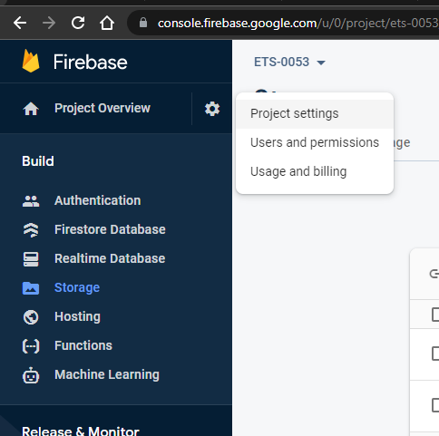
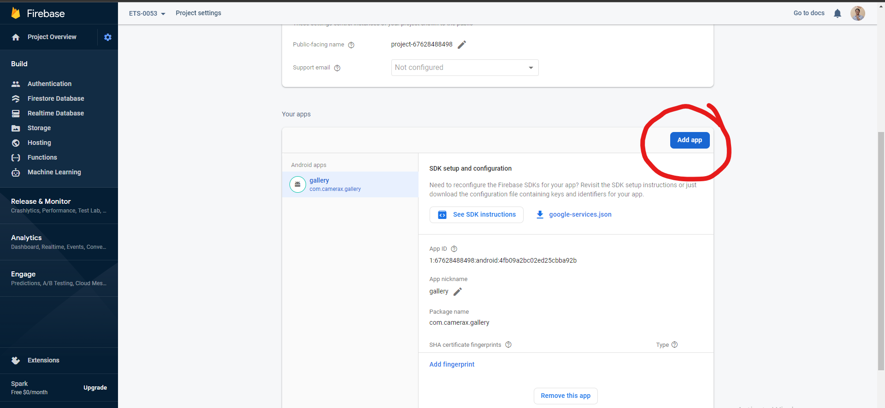
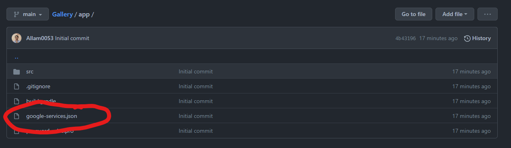

# Gallery
 firebase upload img example

# DEPENDENCIES

### build.gradle (Modul: Gallery.app)

```
dependencies {

    implementation 'androidx.core:core-ktx:1.7.0'
    implementation 'androidx.appcompat:appcompat:1.3.1'
    implementation 'com.google.android.material:material:1.4.0'
    implementation 'androidx.constraintlayout:constraintlayout:2.1.1'

    implementation 'com.google.firebase:firebase-storage-ktx:20.0.0'
    // Import the Firebase BoM
    implementation platform('com.google.firebase:firebase-bom:29.0.0')

    // Declare the dependency for the Firebase SDK for Google Analytics
    implementation 'com.google.firebase:firebase-analytics-ktx'
    implementation 'com.google.firebase:firebase-firestore-ktx:24.0.0'

    testImplementation 'junit:junit:4.+'
    androidTestImplementation 'androidx.test.ext:junit:1.1.3'
    androidTestImplementation 'androidx.test.espresso:espresso-core:3.4.0'
}
```

### build.gradle (Project: Gallery)

```
// Top-level build file where you can add configuration options common to all sub-projects/modules.
buildscript {
    repositories {
        google()
        mavenCentral()
    }
    dependencies {
        classpath "com.android.tools.build:gradle:7.0.2"
        classpath "org.jetbrains.kotlin:kotlin-gradle-plugin:1.5.30"
        classpath 'com.google.gms:google-services:4.3.10'
        // NOTE: Do not place your application dependencies here; they belong
        // in the individual module build.gradle files
    }
}

task clean(type: Delete) {
    delete rootProject.buildDir
}
```

# ADD APLICATION PROJECT FROM FIREBASE

### go to project setting



### add new app



### place the google-services.json to ~/app/google-services.json



environment has been set. ready <strong>GO WILD!!!</strong>

# Main Activity

```kt
import android.app.Activity
import android.content.Intent
import android.net.Uri
import androidx.appcompat.app.AppCompatActivity
import android.os.Bundle
import android.provider.MediaStore
import android.widget.Button
import android.widget.Toast
import com.google.android.gms.tasks.Continuation
import com.google.android.gms.tasks.Task
import com.google.firebase.firestore.FirebaseFirestore
import com.google.firebase.storage.FirebaseStorage
import com.google.firebase.storage.StorageReference
import com.google.firebase.storage.UploadTask
import java.io.IOException
import java.util.*
import kotlin.collections.HashMap

class MainActivity : AppCompatActivity() {

    private val PICK_IMAGE_REQUEST = 71
    private var filePath: Uri? = null
    private var firebaseStore: FirebaseStorage? = null
    private var storageReference: StorageReference? = null

    override fun onCreate(savedInstanceState: Bundle?) {
        super.onCreate(savedInstanceState)
        setContentView(R.layout.activity_main)
//        setSupportActionBar(toolbar)
        supportActionBar?.setDisplayHomeAsUpEnabled(true)

        firebaseStore = FirebaseStorage.getInstance()
        storageReference = FirebaseStorage.getInstance().reference

        val btn_choose_image = findViewById<Button>(R.id.btn_choose_image)
        val btn_upload_image = findViewById<Button>(R.id.btn_upload_image)
        btn_choose_image.setOnClickListener { launchGallery() }
        btn_upload_image.setOnClickListener { uploadImage() }
    }

    private fun launchGallery() {
        val intent = Intent()
        intent.type = "image/*"
        intent.action = Intent.ACTION_GET_CONTENT
        startActivityForResult(Intent.createChooser(intent, "Select Picture"), PICK_IMAGE_REQUEST)
    }

    override fun onActivityResult(requestCode: Int, resultCode: Int, data: Intent?) {
        super.onActivityResult(requestCode, resultCode, data)
        if (requestCode == PICK_IMAGE_REQUEST && resultCode == Activity.RESULT_OK) {
            if(data == null || data.data == null){
                return
            }

            filePath = data.data
            try {
                val bitmap = MediaStore.Images.Media.getBitmap(contentResolver, filePath)
//                setImageBitmap(bitmap)
                uploadImage()
            } catch (e: IOException) {
                e.printStackTrace()
            }
        }
    }

    private fun addUploadRecordToDb(uri: String){
        val db = FirebaseFirestore.getInstance()

        val data = HashMap<String, Any>()
        data["imageUrl"] = uri

        db.collection("posts")
            .add(data)
            .addOnSuccessListener { documentReference ->
                Toast.makeText(this, "Saved to DB", Toast.LENGTH_LONG).show()
            }
            .addOnFailureListener { e ->
                Toast.makeText(this, "Error saving to DB", Toast.LENGTH_LONG).show()
            }
    }

    private fun uploadImage(){
        if(filePath != null){
            val ref = storageReference?.child("uploads/" + UUID.randomUUID().toString())
            val uploadTask = ref?.putFile(filePath!!)

            val urlTask = uploadTask?.continueWithTask(Continuation<UploadTask.TaskSnapshot, Task<Uri>> { task ->
                if (!task.isSuccessful) {
                    task.exception?.let {
                        throw it
                    }
                }
                return@Continuation ref.downloadUrl
            })?.addOnCompleteListener { task ->
                if (task.isSuccessful) {
                    val downloadUri = task.result
                    addUploadRecordToDb(downloadUri.toString())
                } else {
                    // Handle failures
                }
            }?.addOnFailureListener{

            }
        }else{
            Toast.makeText(this, "Please Upload an Image", Toast.LENGTH_SHORT).show()
        }
    }

}
```

# RES FILE

### Add internet permission

add it to AndroidManifest.xml

```xml
<uses-permission android:name="android.permission.INTERNET" />
```

### activity_main.xml

```xml
<?xml version="1.0" encoding="utf-8"?>
<LinearLayout
    xmlns:android="http://schemas.android.com/apk/res/android"
    xmlns:tools="http://schemas.android.com/tools"
    xmlns:app="http://schemas.android.com/apk/res-auto"
    android:layout_width="match_parent"
    android:layout_height="match_parent"
    app:layout_behavior="@string/appbar_scrolling_view_behavior"
    tools:context=".MainActivity"
    android:padding="30dp"
    android:orientation="vertical"
    >

    <ImageView
        android:id="@+id/image_preview"
        android:layout_width="wrap_content"
        android:layout_height="wrap_content"
        android:src="@drawable/ic_image_gray"
        />

    <Button
        android:id="@+id/btn_choose_image"
        android:layout_width="match_parent"
        android:layout_height="wrap_content"
        android:text="Choose image"
        />

    <Button
        android:id="@+id/btn_upload_image"
        android:layout_width="match_parent"
        android:layout_height="wrap_content"
        android:text="Upload image"
        />

</LinearLayout>
```

For the drawable @drawable/ic_image_gray just create any icon drawable.